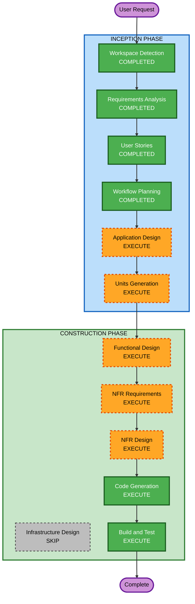

# Execution Plan - 테이블오더 서비스

## Detailed Analysis Summary

### Change Impact Assessment
- **User-facing changes**: Yes - 고객 주문 UI + 관리자 대시보드 (완전 신규)
- **Structural changes**: Yes - 전체 시스템 아키텍처 신규 설계
- **Data model changes**: Yes - 전체 데이터베이스 스키마 신규 설계
- **API changes**: Yes - 전체 REST API 신규 설계
- **NFR impact**: Yes - 보안(JWT, bcrypt), 실시간 통신(SSE), 성능

### Risk Assessment
- **Risk Level**: Medium (신규 프로젝트이므로 기존 시스템 영향 없음, 다만 다수 컴포넌트 통합 필요)
- **Rollback Complexity**: Easy (신규 프로젝트)
- **Testing Complexity**: Moderate (실시간 통신, 세션 관리, 상태 전이 테스트 필요)

---

## Workflow Visualization



### Text Alternative
```
INCEPTION PHASE:
  1. Workspace Detection      [COMPLETED]
  2. Requirements Analysis    [COMPLETED]
  3. User Stories             [COMPLETED]
  4. Workflow Planning        [COMPLETED]
  5. Application Design      [EXECUTE]
  6. Units Generation        [EXECUTE]

CONSTRUCTION PHASE:
  7. Functional Design       [EXECUTE] (per-unit)
  8. NFR Requirements        [EXECUTE] (per-unit)
  9. NFR Design              [EXECUTE] (per-unit)
 10. Infrastructure Design   [SKIP]
 11. Code Generation         [EXECUTE] (per-unit)
 12. Build and Test          [EXECUTE]
```

---

## Phases to Execute

### INCEPTION PHASE
- [x] Workspace Detection (COMPLETED)
- [x] Requirements Analysis (COMPLETED)
- [x] User Stories (COMPLETED)
- [x] Workflow Planning (IN PROGRESS)
- [ ] Application Design - **EXECUTE**
  - **Rationale**: 신규 프로젝트로 컴포넌트 식별, 서비스 레이어 설계, 컴포넌트 간 의존성 정의 필요
- [ ] Units Generation - **EXECUTE**
  - **Rationale**: 다중 컴포넌트(백엔드 API, 고객 UI, 관리자 UI, DB) 시스템으로 작업 단위 분해 필요

### CONSTRUCTION PHASE
- [ ] Functional Design - **EXECUTE** (per-unit)
  - **Rationale**: 새로운 데이터 모델, 비즈니스 로직(세션 관리, 주문 상태 전이), API 설계 필요
- [ ] NFR Requirements - **EXECUTE** (per-unit)
  - **Rationale**: 보안(JWT, bcrypt, 입력 검증), 실시간 통신(SSE), 성능 요구사항 존재
- [ ] NFR Design - **EXECUTE** (per-unit)
  - **Rationale**: NFR Requirements에서 도출된 패턴을 설계에 반영 필요
- [ ] Infrastructure Design - **SKIP**
  - **Rationale**: MVP 단계에서는 클라우드 인프라 상세 설계보다 로컬 개발 환경 우선. 배포 환경은 Build and Test에서 Docker Compose로 커버
- [ ] Code Generation - **EXECUTE** (ALWAYS, per-unit)
  - **Rationale**: 구현 계획 수립 및 코드 생성 필수
- [ ] Build and Test - **EXECUTE** (ALWAYS)
  - **Rationale**: 빌드, 테스트, 검증 필수

### OPERATIONS PHASE
- [ ] Operations - **PLACEHOLDER**
  - **Rationale**: 향후 배포 및 모니터링 워크플로우

---

## Success Criteria
- **Primary Goal**: 단일 매장 테이블오더 MVP 시스템 구현
- **Key Deliverables**:
  - Python FastAPI 백엔드 (인증, 주문, 메뉴, 테이블 관리 API)
  - React TypeScript 고객용 UI (메뉴 조회, 장바구니, 주문)
  - React TypeScript 관리자용 UI (대시보드, 실시간 모니터링)
  - MySQL 데이터베이스 스키마
  - Property-Based Tests (Hypothesis + fast-check)
  - Docker Compose 개발 환경
- **Quality Gates**:
  - 모든 보안 규칙(SECURITY-01~15) 준수
  - 모든 PBT 규칙(PBT-01~10) 준수
  - 단위 테스트 + 통합 테스트 통과
  - SSE 실시간 주문 알림 2초 이내
